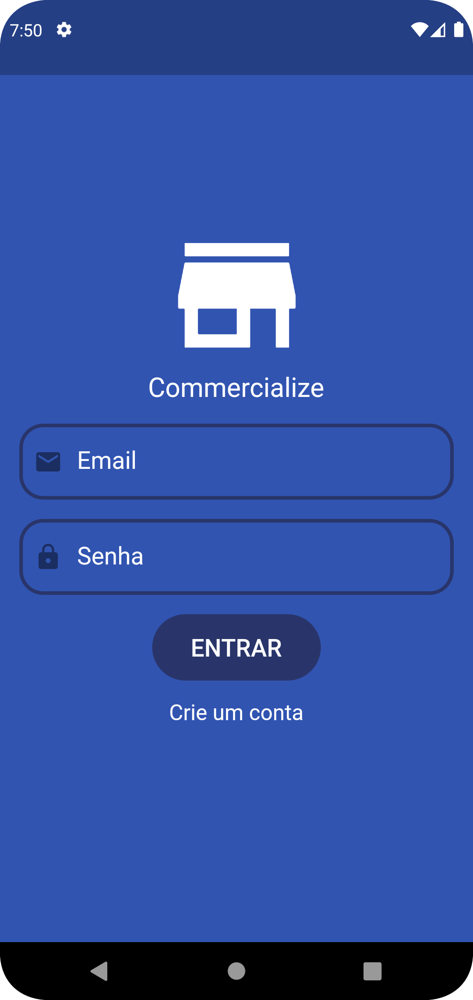
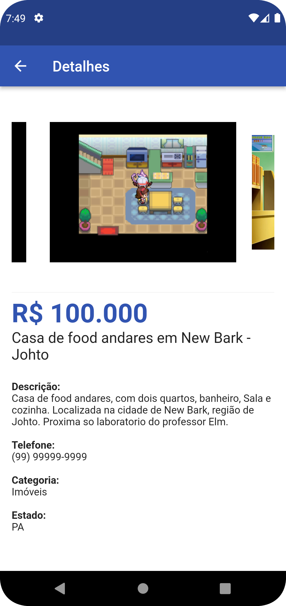

# commercialize

Este é um projeto de uma aplicação mobile construida com o Flutter e seguindo o padrão arquitetural MVVM, ela foi desenvolvida para fins de aprendizado. O projeto consiste um aplicativo de postagem de anúncios de venda de produtos. Ele é uma versão simplificada de aplicativo como Mercado Livre e OXL.

## Tecnologias e Bibliotecas

Este aplicativo foi construído com o Flutter e utiliza as seguintes bibliotecas:

- `Provider` e `MobX`: para gerenciamento de estado;
- `Firebase`: para fazer a autenticação de usuários e armazenamento de dados;
- `image_picker`: para selecionar imagens da galeria ou da câmera do dispositivo.

## Capturas de Tela

      

